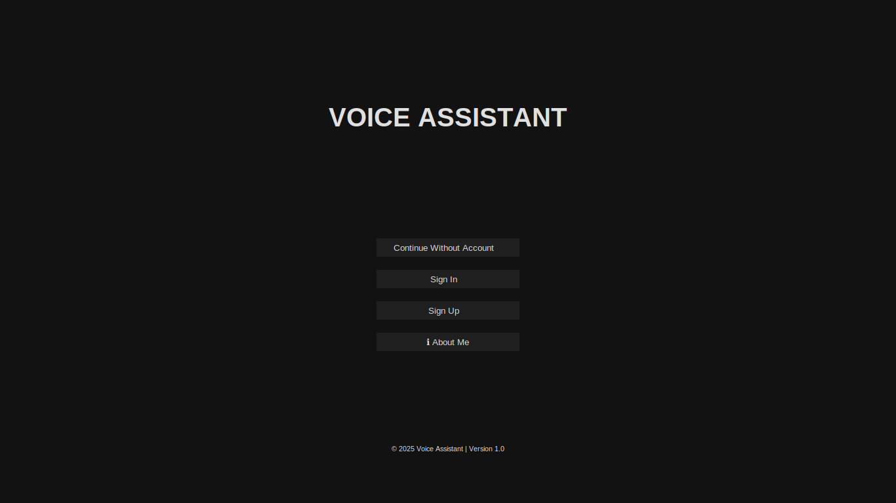
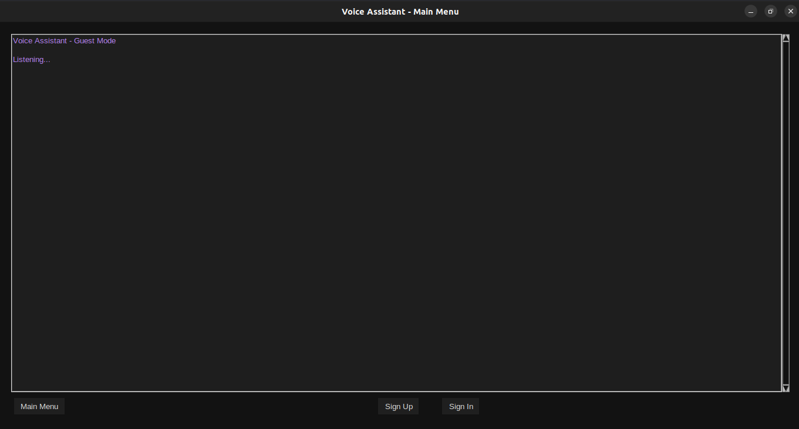
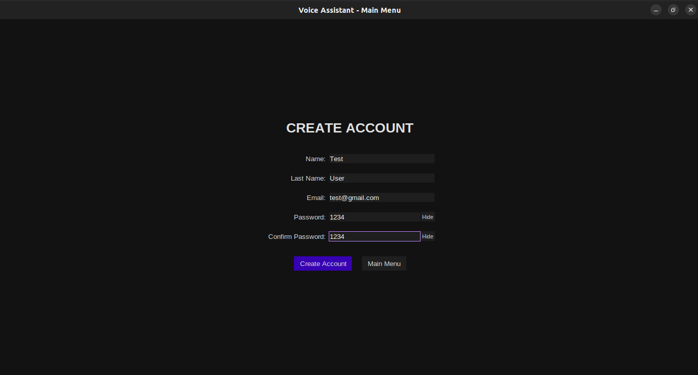
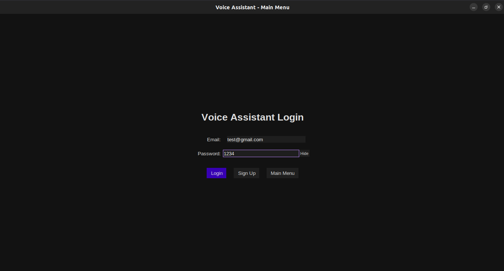
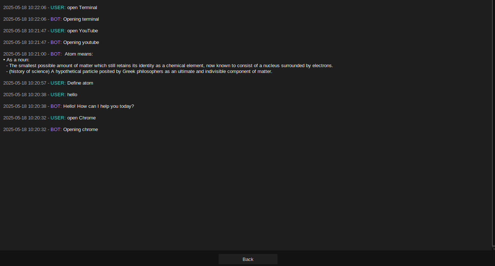

# Voice Assistant with GUI

A cross-platform, voice-controlled desktop assistant built using Python. This assistant provides a graphical user interface (GUI) and a wide array of functionalities including system control, web information retrieval, and user-specific features backed by an SQLite database.

---

## Features

* 🎙️ **Voice Recognition** with real-time response
* 💬 **Text-to-Speech Output** (TTS)
* 🧑‍💼 **User Authentication System** (Sign up / Sign in)
* 🗃️ **User-specific conversation history**
* ⚙️ **Settings page** with user details
* 🧠 **Multi-function intelligent assistant**, including:

  * Unit conversion
  * Wikipedia search
  * News summarization
  * Weather information
  * Word explanations and simplifications
  * World time zones
  * Holiday lookups
* 🖥️ **System control** commands (open apps, lock, shutdown, restart)
* 🌐 **Web integration** (opens links, searches online)
* 🎨 **Dark-themed GUI** built with `tkinter`
* 🛡️ **Secure password hashing** with `argon2`
* 🧠 **Multithreading** for non-blocking GUI and voice interaction

---

## How It Works

This voice assistant is designed to be intuitive, user-friendly, and robust against user errors. It includes built-in error handling for common mistakes such as empty form fields, duplicate accounts, invalid login credentials, or unsupported voice commands. These issues are gracefully managed and shown to the user through informative message boxes in the GUI.

When the application is launched:

1. **Database Initialization**: A local SQLite database is created (`user.db`) if it does not already exist. It sets up tables for users and conversation history.
2. **Main Window Configuration**: The GUI initializes using a fullscreen dark theme.
3. **User Authentication**: Users are directed to sign in or sign up, or optionally continue as a guest.
4. **Voice Assistant Activation**: Once logged in or in guest mode, the assistant becomes active, continuously listening for commands and responding with voice.

### User Interface Pages

* **Sign Up Page**: Collects username, email, and password to register a new user. Information is securely stored in the database with hashed passwords.
* **Sign In Page**: Authenticates existing users using their email and password. Verifies credentials using hashed password verification.
* **Continue Without Account (Guest Mode)**: Allows the user to use the assistant without creating an account. Limited to session-based interactions only.
* **About Me Page**: Displays application and author details.
* **Settings Page**: Shows the logged-in user's information and allows updates to their profile.
* **History Page**: Displays a conversation log specific to the currently logged-in user, showing past questions and responses.

---

## Setup & Installation

1. **Clone the repository**

   ```bash
   git clone https://github.com/waziri245/Voice-Assistant.git
   cd Voice-Assistant
   ```

2. **Install dependencies**

   ```bash
   pip install -r requirements.txt
   ```

3. **Run the application**

   ```bash
   python src/Voice_Assistant.py
   ```

---

## Functionalities the Assistant Can Perform

### 🔧 System Controls

* `open calculator`
* `open browser`
* `open terminal`
* `open file manager`
* `open command prompt`
* `open visual studio code`
* `open notepad`
* `open settings`
* `open control panel`
* `lock computer`
* `shutdown computer`
* `restart computer`

### 🌐 Web and Knowledge

* `search wikipedia for <topic>`
* `explain <word>`
* `simplify <word>`
* `what's the weather in <city>`
* `get news summaries`
* `world time in <city>`
* `holidays in <month>`

### 📐 Unit Conversion

* Convert between:

  * Length: mm, cm, m, km, in, ft, yd, mi
  * Weight: mg, g, kg, oz, lb
  * Volume: ml, l, gal, qt, pt, cup, fl oz
  * Temperature: C, F

### 👥 User Management

* Sign up / Sign in securely
* Continue as guest
* View and update user settings
* View history of previous interactions

---

## Commands the Assistant Can Process

The following voice commands are recognized and processed by the assistant (mostly handled inside the `listen_and_respond` function):

* "what's the time"
* "shutdown computer"
* "restart computer"
* "lock computer"
* "open calculator"
* "open browser"
* "open terminal"
* "open command prompt"
* "open visual studio code"
* "open notepad"
* "open file manager"
* "open control panel"
* "open settings"
* "convert <value> \<from\_unit> to \<to\_unit>"
* "news" or "show me the news"
* "weather in <city>"
* "explain <word>"
* "simplify <word>"
* "wikipedia <topic>"
* "holidays in <month>"
* "world time in <city>"
* "thank you", "goodbye", or other polite endings to close the assistant

The assistant is designed to understand a variety of phrasing and execute the appropriate function automatically.

---

## File Structure

```
Voice-Assistant/
├── .github/
│   └── workflows/
│       └── python-tests.yml
├── assets/                         # Screenshots and image assets
│   ├── Main_Screen.png
│   ├── Guest_Mode.png
│   ├── Sign-up.png
│   ├── Sign-in.png
│   ├── Logged-in_User.png
│   └── History.png
├── src/
│   ├── __init__.py
│   └── Voice_Assistant.py          # Main application logic
├── tests/
│   ├── __init__.py
│   └── test_Voice_Assistant.py     # Unit tests
├── .gitignore
├── LICENSE
├── README.md
├── requirements.txt                # Python dependencies
└── setup.py                        # Package configuration
```

---

## Technologies Used

* **Python 3**
* **tkinter** - GUI
* **speech\_recognition** - Voice input
* **pyttsx3** - Text-to-speech
* **wikipedia**, **requests** - Web data
* **sqlite3** - Local data storage
* **argon2-cffi** - Secure password hashing
* **holidays**, **pytz** - Global time & calendar support

---

## License

This project is licensed under the MIT License - see the [LICENSE](LICENSE) file for details.

---

## Author

Developed with passion by Atal Abdullah Waziri, co-founder of [Stellar Organization](https://stellarorganization.mystrikingly.com/).

---

## Screenshots of the Program

Below are some key screenshots of the voice assistant application in action:

**Main Interface:** The initial screen with options to Sign In, Sign Up, or Continue as Guest.


**Guest Mode Page:** Interface shown when a user continues without an account.


**Sign-up Page:** New users can create an account with username, email, and password.


**Sign-in Page:** Existing users log in securely using their credentials.


**Logged-in User Page:** Main interface after successful login, enabling voice interaction.


**History Page:** Displays a list of previously asked questions and responses.
